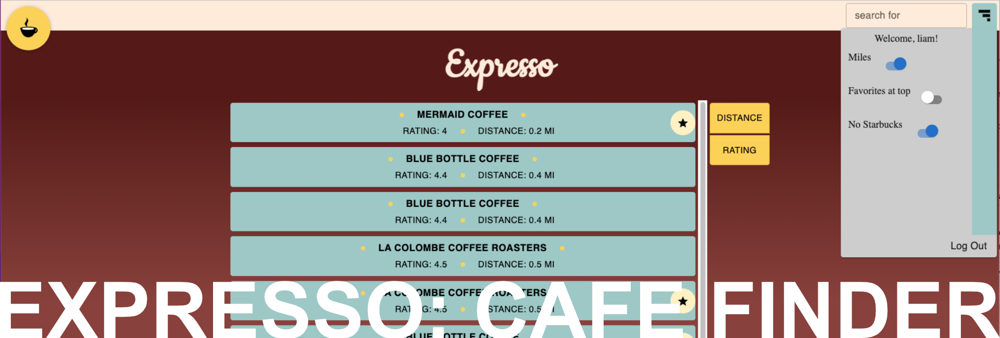

# You've found the GitHub page of one Liam Richardson! Enjoy!
### Software engineer, Hack Reactor grad, artist, pun-maker.
You can reach me at [Linkedin](https://www.linkedin.com/in/richardson-liam/) or by email: <liam@richardsonconcepts.com>

## Applications

## Game Projects

